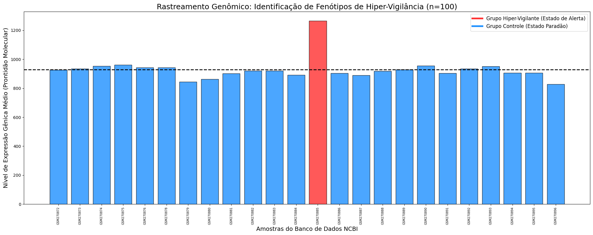

# Análises Transcriptômicas: Fenótipos de Vigilância

## Visão Geral
Estudo *in silico* focado em investigar a possível relação entre o transtorno de ansiedade generalizada e a modulação positiva da resposta imunológica, utilizando mineração de bases de dados oficiais[span_4](start_span)[span_4](end_span). Trabalho apresentado e publicado no **VII Congresso Brasileiro de Ciências Biológicas (CONBRACIB)**.

* **Artigo / Resumo Publicado:** [Acesse a publicação (DOI)](https://share.google/hdVC48A4HWLJAFMR5)
* **Dataset de Origem (NCBI GEO):** [GSE10718](https://www.ncbi.nlm.nih.gov/geo/query/acc.cgi?acc=GSE10718)[span_5](start_span)[span_5](end_span)[span_6](start_span)[span_6](end_span)
* **Script de Execução (Google Colab):** [Acessar Notebook](https://colab.research.google.com/drive/1WRV3AXgwpFj7yvNIHXuicBsfyC05hS4)[span_7](start_span)[span_7](end_span)

##  Metodologia e Pipeline
* **Ferramentas e Bibliotecas:** Python executado no Google Colab utilizando `GEOParse` para captura dos dados, além de `Pandas`, `Seaborn` e `Matplotlib` para estruturação e visualização estatística[span_8](start_span)[span_8](end_span)[span_9](start_span)[span_9](end_span).
* **Análise Populacional:** Rastreamento de 100 amostras ($n=100$) para o cálculo da média de expressão genômica global[span_10](start_span)[span_10](end_span).

## Resultados e Visualizações
Abaixo está representada a assinatura genômica global obtida através da matriz de expressão diferencial[span_11](start_span)[span_11](end_span):

[span_12](start_span)[span_12](end_span)[span_13](start_span)[span_13](end_span)
